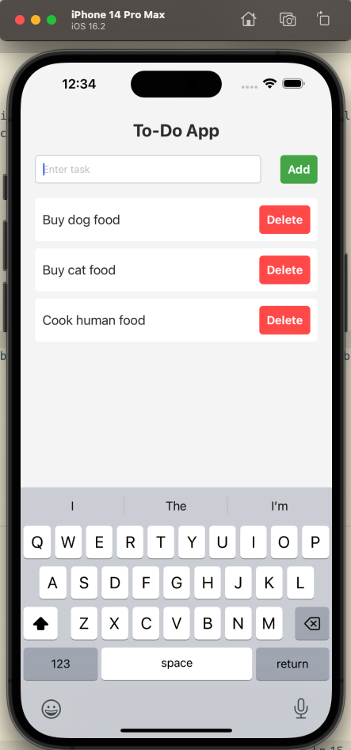
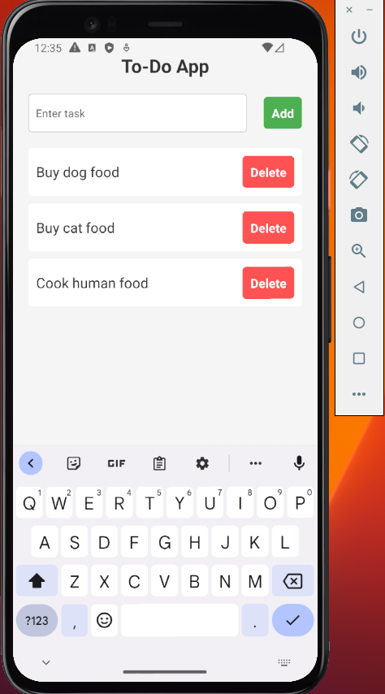

# Introduction to styling in React Native

This is a to-do application that teaches state management in mobile development using React Native. This application was adapted and improved based on what ChatGPT generated. The prompts that were used to solicit the rough code base from ChatGPT include:

* build a to-do app using React Native
* improve the style of this app

This application will render to iOS as follows:

This application will render to Android as follows:

This appliation is a teaching and learning demo developed by [Qiang Hao](https://qhao.info/) for CSCI 412 Mobile Development at Western Washington University.

